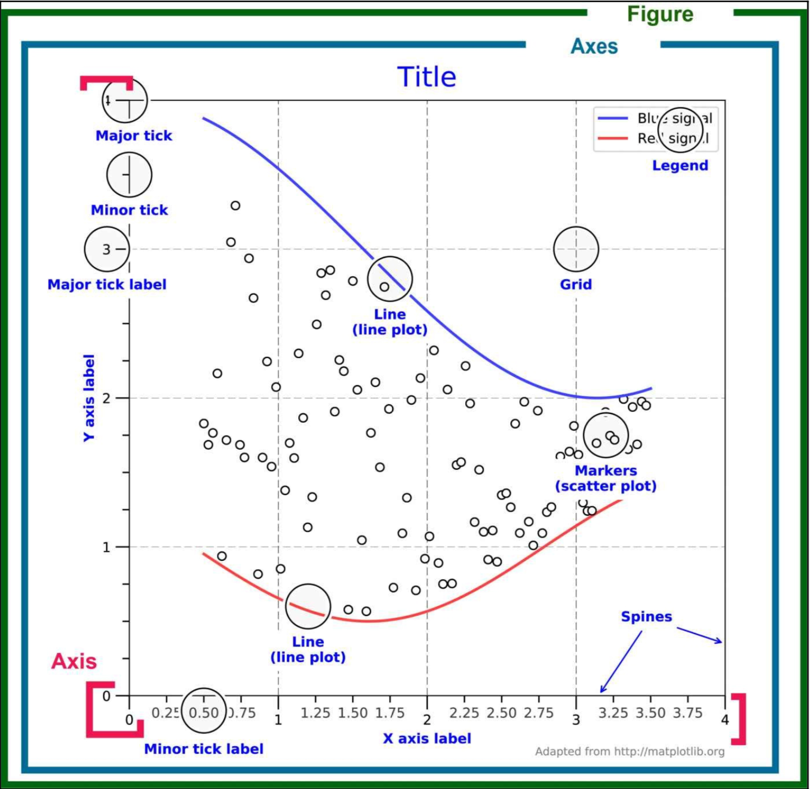

# <p align="center"> Matplotlib </p> 

> This page is under construction

## What is Matplotlib

Matplotlib is a multiplatform data visualization library built on NumPy arrays 
> Matplotlib is probably the most used Python package for 2D-graphics. It provides both a quick way to visualize data from Python and publication-quality figures in many formats.

## Features of Matplotlib

* Easy to get started
* Support for LATEX formatted labels and texts
* Great control of every element in a figure, including figure size and DPI.
* High-quality output in many formats, including PNG, PDF, SVG, EPS, and PGF.
* GUI for interactively exploring figures and support for headless generation of figure files (useful for batch jobs).

## Installing Matplotlib

apt | yum | pip
----|--------|--------------
`apt-get install python3-matplotlib`  | `sudo yum install python3-matplotlib` |  `pip3 install Matplotlib`

## Package import 

```
import matplotlib as mpl 
import matplotlib.pyplot as plt
```


## Matplotlib figure structure 



Component | Description
----------|------------
Figure | One Figure is complete plot area which includes everything including Subplots.
Subplot | Subplot is like sub part of figure which contains all data to be displayed on same axes.
 Axis | These are the number-line-like objects. They take care of setting the graph limits and generating the ticks.
 Axes| The Axes contains two (or three in the case of 3D) Axis objects (be aware of the difference between Axes and Axis) which take care of the data limits.
 Spine|Spine are four lines that denote the boundaries of the data area.
 Grid|Grids are lines inside the data area that aid the reading of values.
 Title|A name of figure that describes the figure
 Axis Labels|Description of each axis, unit should be given if applicable.
 Ticks|Ticks are marks of division on a plot axis.Types -  Major or minor
 Tick labels|Both major and minor ticks can be labelled.
 Legend|Labels for each data series
 Patches|Different shapes can be added using `matplotlib.patches` like rectangle, circle etc.

## pyplot

pyplot provides a procedural interface to the matplotlib object-oriented plotting library. It is modelled closely after MatlabTM. Therefore, the majority of plotting commands in pyplot have MatlabTM analogy with similar arguments. 

Type of plot|	Function & Description | Example
------------|-------------------------|----
bar	|Make a bar plot.|
barh|	Make a horizontal bar plot.|
boxplot	|Make a box and whisker plot.|
hist	|Plot a histogram.|
hist2d	|Make a 2D histogram plot.|
pie	 |Plot a pie chart.|
plot |	Plot lines and/or markers to the Axes.|[simple plot](#simple-plot-or-line-space)
polar|	Make a polar plot..|
scatter	|Make a scatter plot of x vs y.|
stackplot|	Draws a stacked area plot.	|
stem|	Create a stem plot.|
step	|Make a step plot.|
quiver	|Plot a 2-D field of arrows.|

### Figure Functions

Function | Description
---------|-----------
figtext|Add text to figure.
figure| Creates a new figure.
show| Display a figure.
savefig| Save the current figure.
close| Close a figure window.

### Axis Functions

Function|	Description | Example
--------|---------------|-----------
axes	|Add axes to the figure.|
text|	Add text to the axes.|
title |	Set a title of the current axes.|
xlabel |	Set the x axis label of the current axis.|
xlim	|Get or set the x limits of the current axes.|
xscale	|.|
xticks	|Get or set the x-limits of the current tick locations and labels.|
ylabel	|Set the y axis label of the current axis.|
ylim	|Get or set the y-limits of the current axes.|
yscale	|Set the scaling of the y-axis.|
yticks	|Get or set the y-limits of the current tick locations and labels.|

### Image Functions

Function|	Description
--------|------------------
imread| Read an image from a file into an array.
imsave | Save an array as in image file.
imshow | Display an image on the axes.


## Simple plot or line space

For simple line plot we call `plot` method from `pyplot`

Plot method taks parameters as :

Parameters| Description| Type |  example
----------|------------|------|---------
x, y| Data to be projected in plot. x values are optional -  default: `range(len(y))` | array or list | `plt.plot(x,y)`
fmt | basic plot properties '[marker][line][color]'. Optional| string | `plt.plot(x,y, 'o-r')`
data| we can give data in this, like formats, labels. Optional|  indexable object| `plt.plot(x,y, color='r', linestyle='-', label='Agra Temp')`
b8

#### Color

Symbol | Colour
-------|------
b| Blue
g| Green
r| Red
c| Cyan
m| Magenta
y| Yellow
k| Black
w| White

> We can give RGB values as well, it will be float values from (0-1) for each Red, Green, Blues ,degree of transparency(optional)  or #ffffff


Example 1

```
>>> from matplotlib import pyplot as plt
>>> import numpy as np
>>> X = np.linspace(0, 2*np.pi, 256)
>>> C, S = np.cos(X), np.sin(X)
>>> plt.plot(X, C)
[<matplotlib.lines.Line2D object at 0x11ad8d390>]
>>> plt.plot(X, S)
[<matplotlib.lines.Line2D object at 0x11ad8d990>]
>>> plt.show()
```
 

Example 2

```
>>>import matplotlib.pyplot as plt
>>>agra_avg_temp = [14.6, 17.9, 23.7, 29.8, 34.2, 35, 30.9, 29.3, 28.9, 26.1, 20.5, 16]
>>>months = ['Jan', 'Feb', 'Mar', 'Apr', 'May', 'Jun', 'Jul', 'Aug', 'Sep', 'Oct', 'Nov', 'Dec']
>>> plt.plot(months, agra_avg_temp, color='r', linestyle='-', label='Agra Temp')
[<matplotlib.lines.Line2D object at 0x11a4a4450>]
>>> plt.title('Agra Temp')
Text(0.5, 1.0, 'Agra Temp')
>>> plt.xlabel('Months')
Text(0.5, 0, 'Months')
>>> plt.ylabel('Temp in Celsius')
Text(0, 0.5, 'Temp in Celsius')
>>> plt.show()
```
 

## Adding Legend and labels

Calling legend() with no arguments automatically fetches the legend handles and their associated labels

Example 1

```	
>>> plt.plot(X, S, label='Sin')
[<matplotlib.lines.Line2D object at 0x1193d2a90>]
>>> plt.plot(X, C, label='Cos')
[<matplotlib.lines.Line2D object at 0x1193d2d50>]
>>> plt.legend()
<matplotlib.legend.Legend object at 0x1194a4c50>
>>> plt.show()
```	


Example 2

```
>>>import matplotlib.pyplot as plt
>>>agra_avg_temp = [14.6, 17.9, 23.7, 29.8, 34.2, 35, 30.9, 29.3, 28.9, 26.1, 20.5, 16]
>>>pune_avg_temp = [21.3, 23.1, 26.3, 29, 29.6, 27.3, 24.8, 24.5, 24.8, 25.5, 23, 21.1]
>>>months = ['Jan', 'Feb', 'Mar', 'Apr', 'May', 'Jun', 'Jul', 'Aug', 'Sep', 'Oct', 'Nov', 'Dec']
>>> plt.plot(months, agra_avg_temp, color='r', linestyle='-', label='Agra Temp')
[<matplotlib.lines.Line2D object at 0x11d445bd0>]
>>> plt.plot(months, pune_avg_temp, color='b', linestyle='-', label='Pune Temp')
[<matplotlib.lines.Line2D object at 0x11d44f4d0>]
>>> plt.title('Yearly Temp')
Text(0.5, 1.0, 'Yearly Temp')
>>> plt.xlabel('Months')
Text(0.5, 0, 'Months')
>>> plt.ylabel('Temp in Celsius')
Text(0, 0.5, 'Temp in Celsius')
>>> plt.legend()
<matplotlib.legend.Legend object at 0x11d2e7210>
>>> plt.tight_layout()
>>> plt.grid(True)
>>> plt.show()
```
 

#### Setting ticks
```
>>> plt.plot(X, S, label='Sin')
[<matplotlib.lines.Line2D object at 0x118255c50>]
>>> plt.plot(X, C, label='Cos')
[<matplotlib.lines.Line2D object at 0x119319410>]
>>> plt.yticks([-1, 0, +1])
([<matplotlib.axis.YTick object at 0x11adc31d0>, <matplotlib.axis.YTick object at 0x1171363d0>, <matplotlib.axis.YTick object at 0x118826590>], <a list of 3 Text yticklabel objects>)
>>> plt.xticks([0, np.pi/2, np.pi, 3*np.pi/2, 2*np.pi])
([<matplotlib.axis.XTick object at 0x117136150>, <matplotlib.axis.XTick object at 0x118826410>, <matplotlib.axis.XTick object at 0x118826090>, <matplotlib.axis.XTick object at 0x11822db10>, <matplotlib.axis.XTick object at 0x10ec54610>], <a list of 5 Text xticklabel objects>)
>>> plt.legend()
<matplotlib.legend.Legend object at 0x117148610>
>>> plt.show()
```


#### changing color, line width, linestyle, ticks and axes

```
>>> ax = plt.gca()
>>> ax.spines['right'].set_color('none')
>>> ax.spines['top'].set_color('none')
>>> ax.xaxis.set_ticks_position('bottom')
>>> ax.spines['bottom'].set_position(('data',0))
>>> ax.yaxis.set_ticks_position('left')
>>> ax.spines['left'].set_position(('data',0))
>>> plt.xticks([-np.pi, -np.pi/2, 0, np.pi/2, np.pi],
           [r'$-\pi$', r'$-\pi/2$', r'$0$', r'$+\pi/2$', r'$+\pi$'])
([<matplotlib.axis.XTick object at 0x10e51f8d0>, <matplotlib.axis.XTick object at 0x10e462e50>, <matplotlib.axis.XTick object at 0x10e53a610>, <matplotlib.axis.XTick object at 0x10e53ab10>, <matplotlib.axis.XTick object at 0x10e53af10>], <a list of 5 Text xticklabel objects>)
>>> plt.yticks([-1, 0, +1],
           [r'$-1$', r'$0$', r'$+1$'])
([<matplotlib.axis.YTick object at 0x10e51f190>, <matplotlib.axis.YTick object at 0x10e462d10>, <matplotlib.axis.YTick object at 0x10e546a90>], <a list of 3 Text yticklabel objects>)
>>> plt.plot(X, C, color="blue", linewidth=2.5, linestyle="-", label="cosine")
[<matplotlib.lines.Line2D object at 0x10e54d1d0>]
>>> plt.plot(X, S, color="red",  linewidth=2.5, linestyle="-", label="sine")
[<matplotlib.lines.Line2D object at 0x10e546d10>]
>>> plt.legend(loc='upper right')
<matplotlib.legend.Legend object at 0x117ba8750>
>>> plt.show()
```


## Save plot images in program 

We can save plot images in program and can upload/export to somewhere else.. like generate in backend and load this as image in frontend.

Instead of `plt.show()` use `plt.savefig('plot.png')` 

## Styles in Matplotlib

We can also use any default styles available in matplotlib which will save much time and effor -

```
>>> print(plt.style.available)
['seaborn-dark', 'seaborn-darkgrid', 'seaborn-ticks', 'fivethirtyeight', 'seaborn-whitegrid', 'classic', '_classic_test', 'fast', 'seaborn-talk', 'seaborn-dark-palette', 'seaborn-bright', 'seaborn-pastel', 'grayscale', 'seaborn-notebook', 'ggplot', 'seaborn-colorblind', 'seaborn-muted', 'seaborn', 'Solarize_Light2', 'seaborn-paper', 'bmh', 'tableau-colorblind10', 'seaborn-white', 'dark_background', 'seaborn-poster', 'seaborn-deep']
```

Example 

```
>>>import matplotlib.pyplot as plt
>>>agra_avg_temp = [14.6, 17.9, 23.7, 29.8, 34.2, 35, 30.9, 29.3, 28.9, 26.1, 20.5, 16]
>>>pune_avg_temp = [21.3, 23.1, 26.3, 29, 29.6, 27.3, 24.8, 24.5, 24.8, 25.5, 23, 21.1]
>>>months = ['Jan', 'Feb', 'Mar', 'Apr', 'May', 'Jun', 'Jul', 'Aug', 'Sep', 'Oct', 'Nov', 'Dec']
>>> plt.style.use('fivethirtyeight')
>>> plt.plot(months, agra_avg_temp,  label='Agra Temp')
[<matplotlib.lines.Line2D object at 0x11c60a3d0>]
>>> plt.plot(months, pune_avg_temp, label='Pune Temp')
[<matplotlib.lines.Line2D object at 0x11c60ac90>]
>>> plt.title('Yearly Temp')
Text(0.5, 1.0, 'Yearly Temp')
>>> plt.xlabel('Months')
Text(0.5, 0, 'Months')
>>> plt.ylabel('Temp in Celsius')
Text(0, 0.5, 'Temp in Celsius')
>>> plt.legend()
<matplotlib.legend.Legend object at 0x11d39c2d0>
>>> plt.tight_layout()
>>> plt.show()
```
 


## Bar Charts

#### Setting ticks

#### Setting tick labels
#### Moving spines


	
## Annotate some points

## Devil is in the details
#### Setting limits

## Figures, Subplots, Axes and Ticks

#### Figures,
#### Subplots,
#### Axes and
#### Ticks

## Other plots

#### Regular
#### Scatter
#### Marker stykes

Symbol|Type
------|----
'o'| Circle
'x'| Cross
'+'| plus
'P'| Filled Plus
'D'| Diamond
's'| Square
'^'| Triangle

```
>>> import numpy as np
>>> import matplotlib.pyplot as plt
>>> import matplotlib.colors
>>> 
>>> n = list(range(5)
... )
>>> n = list(range(5))
>>> n
[0, 1, 2, 3, 4]
>>> s=[i**2*100+100 for i in n ]
>>> s
[100, 200, 500, 1000, 1700]
>>> c= ['red','orange','yellow','green','blue']
>>> plt.scatter(n,n,s=s,c=c)
<matplotlib.collections.PathCollection object at 0x11ad13810>
>>> plt.plot(n,marker='x',color='black',ms=12)
[<matplotlib.lines.Line2D object at 0x11a2c5a50>]
>>> plt.xlim(-0.5,4.5)
(-0.5, 4.5)
>>> plt.ylim(-1,5)
(-1, 5)
>>> plt.show()
```

#### Contour
#### Image show
#### PIE CHARTS
#### Quiver Plots
#### Grids
#### Multi Plots
#### Polar Axis
#### 3D Plots
#### Text